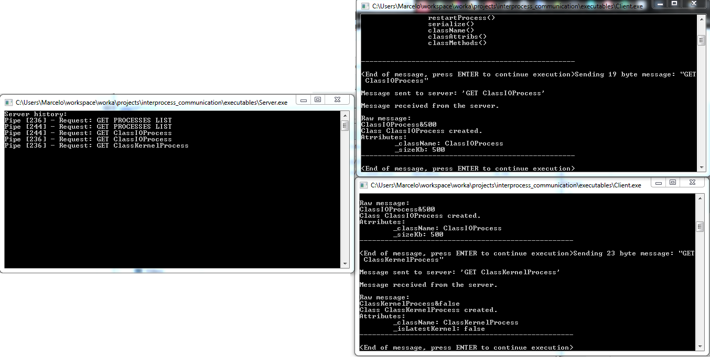

# Interprocess communication using named pipes

This project presents an interprocess communication (client-server) using named pipes. Once the target platform is Windows, it's used a pipe communication based on Microsoft's samples. There are some strategies of named pipe communication, it was used a strategy based on ["Named Pipe Server Using Overlapped I/O"](https://docs.microsoft.com/en-us/windows/desktop/ipc/synchronous-and-overlapped-input-and-output). Using this strategy, the server is capable to response asynchronously several clients.



## Requirements

* The client should connect to the server and make different calls to it, synchronous and asynchronous.
* The client needs to be able to create objects on the server and retrieve them, their attributes and call methods on them.
* It's necessary to send and receive different types of data to/from the server.
* The server needs to register a set of functions/classes for the client to use.

## Solution:
It was used a strategy of having the core classes (used both on server and client) compiled as a Static Library in the same Visual Studio Solution of the Client and Server projects. It was also defined project's dependencies and build order. I implemented an Abstract class Serializable and two samples classes ClassIOProcess e ClassKernelProcess that implements this interface. It has allowed the serialization and deserialization of the message exchanged by client and server. I considered using boost::serialization but it was not possible due to the limited time (8 hours).
The code was compiled using C++17. This has enabled modern C++ features such as move semantics, lambda, auto, and variants. I had planned to build unit tests using googletest (gtest) but I didn't have time to solve some issues of using it in VS2017 with c++17.

### Examples
* The server registers a set of functions/classes for the client to use. The clients can request the list of processes (Class Name, attributes, and methods). Using the method:
```
ICClient::sendMessage("GET PROCESSES LIST")
```
- The clients can request a specific class. Using the method:
```
 ICClient::sendMessage("GET <ClassName>")
```
- The clients can call methods of a class using the method printAttribValues() from the Serializable interface:
```
	obj.printAttribValues();
```
